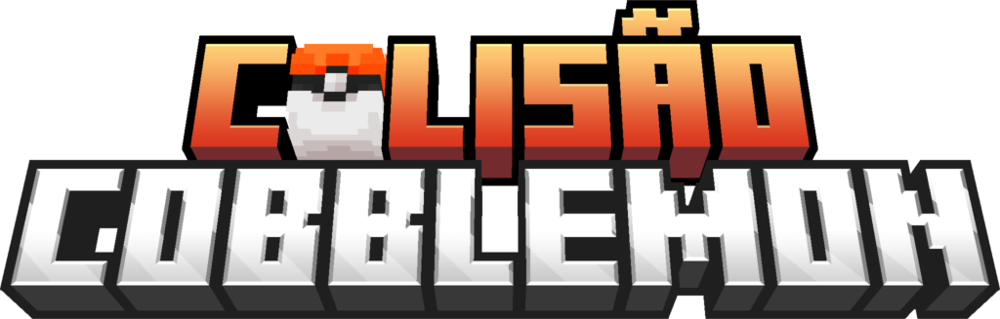

# 🧱 Colisão Cobblemon

<div align="center">
  
</div>

[]()
[]()
[]()

> **A experiência definitiva de Pokémon no Minecraft.**

Bem-vindo ao repositório oficial do **Colisão Cobblemon**. Este projeto traz a verdadeira essência dos jogos Pokémon para dentro do seu Minecraft, combinando as melhores mecânicas da franquia com sistemas exclusivos e um mapa imersivo.

---

## 🌐 Junte-se a Nós

Copie o IP abaixo e adicione à sua lista de servidores multiplayer:

```text
jogar.colisaocobblemon.com.br
```

---

## ✨ Funcionalidades do Servidor
Nosso servidor foi desenhado para oferecer profundidade e diversão, indo além do básico:

### 🛠️ Mecânicas de HMs (Hidden Machines)
A interação com o mundo é vital. Utilize seus Pokémon para superar obstáculos reais no mapa:

* **⛰️ Rock Smash:** Quebre rochas que bloqueiam cavernas e passagens.
* **✂️ Cut:** Corte árvores e vegetação densa para acessar áreas secretas.
* **🌊 Surf:** Explore os oceanos e atravesse lagos montado em seu Pokémon.

### 🗺️ O Mundo e Exploração
* **Regiões Originais:** Aventure-se pelos mapas e regiões oficiais dos jogos, com cidades e ambientes totalmente recriados.
* **Gerações:** O servidor engloba mecânicas de diversas gerações dos jogos originais, trazendo complexidade e nostalgia.

### 🚀 Diferenciais
* **Mecânicas Exclusivas:** Sistemas únicos desenvolvidos para o Colisão Cobblemon.
* **Economia e Eventos:** Um mercado ativo e torneios regulares para treinadores competitivos.

---

## 📥 Como Instalar

1. Certifique-se de ter o **Minecraft Java Edition** instalado.
2. Instale o carregador de mods (**Fabric**) correspondente à versão do servidor.
3. Baixe este Mod/Modpack e coloque na pasta `mods` do seu jogo.
4. Abra o jogo e conecte-se em: `jogar.colisaocobblemon.com.br`

---

## 🤝 Comunidade e Suporte
Não jogue sozinho! Entre na nossa comunidade para trocar itens, marcar batalhas e tirar dúvidas.

* [**Discord Oficial**](https://discord.gg/pCQEge6hUv)
* [**Loja / Site**](SEU_LINK_AQUI)

<div align="center"> <sub>Colisão Cobblemon © 2026. Não afiliado à Mojang ou The Pokémon Company.</sub> </div>